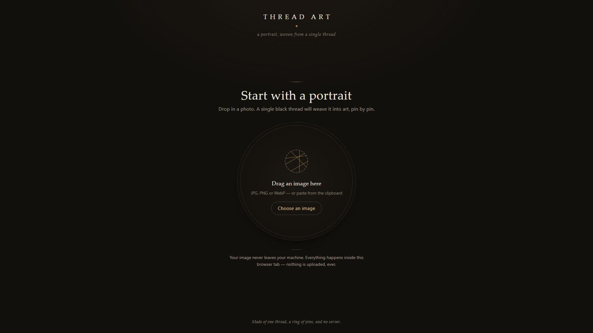
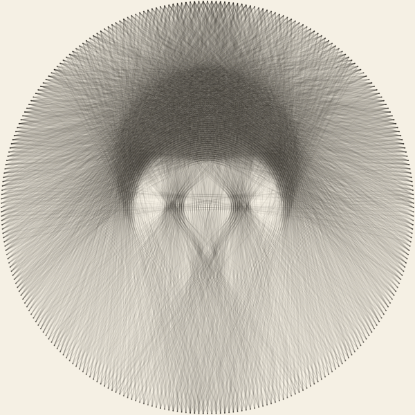

# Thread Art

### Upload an image. Watch one continuous thread build it back.

A browser-based thread-art generator. Position a circular crop, choose the pins and thread budget, then watch a real pin-to-pin sequence accumulate into a woven image. Download the resulting canvas and winding order when it finishes.

**[Open Thread Art](https://thread.graydonwasil.com/) · [Controls](#set-up-the-weave) · [Algorithm](#how-the-image-becomes-thread) · [Downloads](#take-the-result-with-you) · [Run locally](#run-locally)**



*The current live interface before an image has been selected.*

## Upload → crop → weave

1. Choose an image, drag one into the page, or paste an image from the clipboard.
2. Position the circular crop over the area you want to reproduce.
3. Set Pins, Coverage, and Darkness. Open Advanced if you want to control the minimum chord gap.
4. Choose **Start the weave**. The generator computes a continuous route, and the renderer draws that actual sequence.
5. Pause or change playback speed to inspect the construction.
6. At **Woven**, compare the original crop with the result, download it, or try new settings.

JPG/JPEG, PNG, and WebP inputs are supported, with a 100 MiB source-file limit. Empty, undecodable, and unsuitable images produce an error rather than an incomplete run.

## Set up the weave

| Control | Default | Available values | What changes |
| --- | --- | --- | --- |
| **Pins** | 300 | 200–500, in steps of 10 | Number of anchor points around the circular board. |
| **Coverage** | 4,000 passes | 1,000–8,000, in steps of 100 | Maximum number of pin-to-pin thread passes. |
| **Darkness** | 8/255 | 4–32 | How much residual darkness is removed along a chosen chord. |
| **Advanced: Min chord gap** | Auto | Auto or 0–25 | Excludes nearby pins on either side when considering the next chord. |

Auto chord gap uses `max(1, round(pinCount / 30))`. A different gap changes which paths are eligible; a larger thread budget allows more passes but does not guarantee that every input benefits equally.

### Position the crop

| Input | Action |
| --- | --- |
| **Mouse, pen, or touch drag** | Moves the crop over the image. |
| **Arrow keys** | Moves it by eight working-image pixels. |
| **Shift + Arrow keys** | Moves it by sixteen working-image pixels. |
| **Home** | Recenters the crop. |

The keyboard controls work when the crop circle is focused.

The circle uses the largest diameter that fits inside the working image. You reposition it rather than resize or zoom it. A square image has no extra space along either axis for this fixed circle to move through.

## Watch the construction

| Playback control | Behavior |
| --- | --- |
| **Pause / Resume** | Stops or resumes drawing the generated sequence. |
| **Speed** | 0.5×, 1×, 2×, 4×, 8×, or 16×. |
| **Stop the weave** | Asks for a second click within 2.6 seconds, then returns to the crop. |
| **Reduced-motion preference** | Uses a brief stepped finish instead of the normal grow-in presentation. |

At 1×, presentation runs at a target of 60 passes per second. A 4,000-pass sequence therefore takes roughly 67 seconds to draw at that speed; this is not a promise that computation takes the same time. Faster playback changes the presentation, not the selected pin order.

The counter grows from the actual chord lengths in that sequence. It assumes a **24-inch board**, approximately **61 cm**, and measures straight pin-to-pin distance. Physical wrapping around pins, knots, and handling require extra material beyond that estimate.

## Take the result with you

| Finished-state action | Result |
| --- | --- |
| **View original / View woven** | Compares the processed working crop's original color view with the thread result. |
| **Download PNG** | Saves the completed canvas at its working crop resolution. |
| **Download pin sequence** | Saves an ordered text winding list and its settings/assumptions. |
| **Weave again with new settings** | Keeps the image and crop for another run. |
| **Start over with a new image** | Returns to image selection. |

The original comparison is the EXIF-oriented, working-resolution color crop, not the full original uploaded file. The PNG is not a vector export or a full-source-resolution photograph.

The sequence file includes numbered from-pin → to-pin pairs, pin count, used/budget passes, stop reason, darkness, chord gap, length estimates, and board assumptions. **Pin 0 is at the rightmost point, or 3 o'clock; numbering increases clockwise.** Treat the output as a digital construction plan to inspect, not a guarantee of a validated physical fabrication.

## How the image becomes thread



*Engine/canvas output from the repository’s [synthetic-portrait test](docs/ultron/research/spikes/likeness/proof.mjs). This illustrates a computed thread result; it is not a screenshot of the app’s finished state.*

| Stage | Implementation | Purpose |
| --- | --- | --- |
| **Ingest** | EXIF-aware decoding and downscaling to a maximum 600-pixel long side, without upscaling. | Creates a bounded working image. |
| **Prepare darkness** | Rec.709 luminance, transparency over white, circular sampling, conditional contrast normalization. | Produces the residual darkness the thread should cover. |
| **Precompute chords** | Canonical Bresenham pixel-index tables stored in typed arrays. | Makes repeated candidate scoring practical. |
| **Choose a path** | Highest mean remaining darkness among eligible chords from the current pin. | Selects the next thread segment. |
| **Update residual** | Subtract the darkness amount along the chosen chord. | Reduces the incentive to redraw an already-covered region. |
| **Continue** | Start the next chord at the last destination, with deterministic tie-breaking. | Keeps the winding order continuous. |
| **Render** | Streamed batches and translucent black strokes over warm paper. | Shows the actual route becoming an image. |

The current scorer uses **mean darkness per chord**, so chord length alone does not win the comparison. The run stops at the coverage budget or after three consecutive steps without improvement.

A module Web Worker handles computation and streams passes ahead of playback. A time-sliced main-thread fallback uses the same engine. Geometry caches can be reused across compatible runs. At completion, the renderer repaints the canonical sequence once to normalize presentation differences from pause and speed changes.

## Stack and data flow

| Layer | Technology |
| --- | --- |
| **Interface** | Static HTML/CSS and native JavaScript ES modules. |
| **Image processing and artwork** | Canvas 2D and typed arrays. |
| **Computation** | Web Workers, with a time-sliced fallback. |
| **Playback** | requestAnimationFrame and streamed pin-pair batches. |
| **Downloads** | Browser Blob downloads. |

There is no application framework, package installation, build step, or runtime backend. Image processing and weaving run client-side. Your image is not uploaded to an image-processing service.

## Run locally

```bash
git clone https://github.com/Arrangedgodly/thread-art.git
cd thread-art
python3 -m http.server 8000
```

Open `http://localhost:8000`. On Windows, use your installed Python command, such as `py -m http.server 8000`. Any suitable static HTTP server works.

Opening `index.html` directly through `file://` deliberately displays a notice because the app's module-worker workflow needs an HTTP origin.

### Tests and verification

The dependency-free engine test command is:

```bash
node tests/engine.test.mjs
```

Use a modern Node version with the required ES-module behavior. The repository also includes `tests/acceptance.mjs`, a real-browser harness with a `--quick` option. That harness currently assumes a macOS Google Chrome executable path and Node 22+ browser-control APIs, so it is not an unchanged, cross-platform command on Windows or Linux.

The acceptance harness exercises worker/fallback behavior, controls, exports, and a mobile viewport. Its quick mode skips full-duration measurement. The GitHub Actions workflow deploys the static site; it does not run the test suite.

## Source guide

| Area | File |
| --- | --- |
| Interface and controls | [`index.html`](index.html), [`src/main.js`](src/main.js) |
| File validation | [`src/upload.js`](src/upload.js) |
| Decode and normalization | [`src/ingest.js`](src/ingest.js) |
| Crop interaction | [`src/crop.js`](src/crop.js) |
| Greedy engine | [`src/engine.js`](src/engine.js) |
| Worker/fallback scheduling | [`src/compute.js`](src/compute.js) |
| Construction playback | [`src/anim.js`](src/anim.js), [`src/render.js`](src/render.js) |
| Finished-state controls | [`src/complete.js`](src/complete.js) |
| PNG and winding-list export | [`src/download.js`](src/download.js) |

## Project history

The project was developed through an Ultron Supreme multi-agent workflow. Its scoping, planning, research, and per-task verification records remain in [`docs/ultron/`](docs/ultron/). Historical benchmark figures in those records describe their tested configurations, not universal performance guarantees for every device or image.
